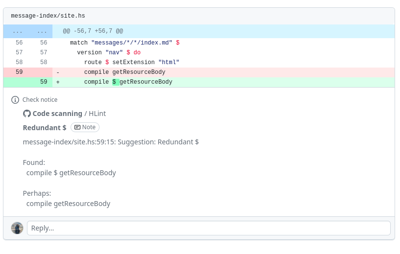

# Code scanning with HLint

This is a GitHub action which scans Haskell code using [HLint]
and uploads its suggested improvements to [GitHub code scanning].

## Usage

A minimal example for setting up code scanning with HLint:

```yaml
name: Scan code with HLint
on: [push, pull_request]

jobs:
  hlint:
    runs-on: ubuntu-latest
    permissions:
      # Needed to upload results to GitHub code scanning.
      security-events: write
    steps:
      - uses: actions/checkout@v4
      - uses: haskell-actions/hlint-scan@v1
```

The action needs [write permission for `security-events`] to upload
the analysis results to GitHub.

If you would like to use this as a [status check] which would prevent pull requests
from being merged until an issue is resolved, you can [adjust the alert severity]
for which code scanning will trigger a failed check.

[status check]: https://docs.github.com/en/pull-requests/collaborating-with-pull-requests/collaborating-on-repositories-with-code-quality-features/about-status-checks

[adjust the alert severity]: https://docs.github.com/en/code-security/code-scanning/creating-an-advanced-setup-for-code-scanning/customizing-your-advanced-setup-for-code-scanning#defining-the-alert-severities-that-cause-a-check-failure-for-a-pull-request

### Inputs

None of the inputs are required.
You only need to set them if the defaults do not work for your situation.

#### `binary`

Path to the hlint binary.

#### `path`

Path of file or directory that HLint will be told to scan.
Multiple paths can be specified, delimited by whitespace.

#### `hints`

Path for [HLint configuration file].

#### `category`

[Category] distinguishing multiple analyses at the same commit.

#### `fail-on`

If not empty, then this disables code scanning and instead outputs annotations.
The value can be one of 'never', 'error', 'warning', or 'note',
which are based on the [levels specified by SARIF],
and it controls at what level a non-zero exit can happen.
This is only intended for use in private GitHub repositories which do not have code scanning available.

### Outputs

#### `sarif-id`

The ID of the uploaded SARIF file.

## Examples

When scanning code with HLint on pushes, issues will show up in
the "Code scanning" dashboard in the "Security" section:


When scanning code with HLint in a pull request, issues with the change
will be reported in the pull request:



## Status

[](https://github.com/haskell-actions/hlint-scan/actions/workflows/build.yaml)
[](https://github.com/haskell-actions/hlint-scan/actions/workflows/hlint.yaml)
[](https://github.com/haskell-actions/hlint-scan/actions/workflows/ormolu.yaml)
[](https://api.securityscorecards.dev/projects/github.com/haskell-actions/hlint-scan)
[](https://bestpractices.coreinfrastructure.org/projects/7237)

## Code of conduct

Be nice; see [`CODE_OF_CONDUCT.md`](docs/CODE_OF_CONDUCT.md) for details.

## Security policy

See [`SECURITY.md`](docs/SECURITY.md) for details.

## Contributing

See [`CONTRIBUTING.md`](docs/CONTRIBUTING.md) for details.

## License

Apache 2.0; see [`LICENSE`](LICENSE) for details.

## Disclaimer

This project is not an official Google project. It is not supported by Google,
and Google specifically disclaims all warranties as to its quality,
merchantability, or fitness for a particular purpose.


[Category]: https://docs.github.com/en/code-security/code-scanning/creating-an-advanced-setup-for-code-scanning/customizing-your-advanced-setup-for-code-scanning#configuring-a-category-for-the-analysis

[GitHub code scanning]: https://docs.github.com/en/code-security/code-scanning/introduction-to-code-scanning/about-code-scanning

[HLint]: https://github.com/ndmitchell/hlint

[HLint configuration file]: https://github.com/ndmitchell/hlint#customizing-the-hints

[write permission for `security-events`]: https://docs.github.com/en/rest/code-scanning/code-scanning?apiVersion=2022-11-28#upload-an-analysis-as-sarif-data

[levels specified by SARIF]: https://github.com/microsoft/sarif-tutorials/blob/main/docs/2-Basics.md#level
